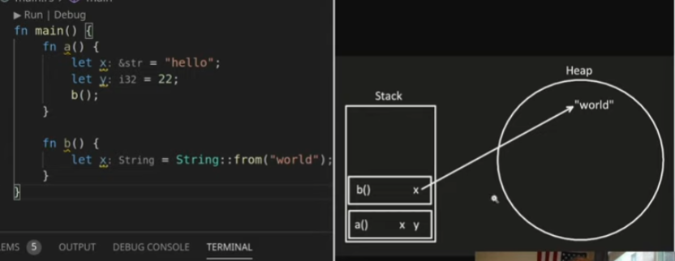

# O que é Ownership?

Ownership é uma maneira de gerenciar memória. Em linguagens como Java ou C# o garbage collection lida com a memória sem necessidade do programador saber algo disso.

O garbage collector porporciona um menor tempo para escrever o código, já que o programador não precisa cuidar da memória e é error free*, ou seja, o programador pode ter quase certeza de que não haveram erros com relação a memória
No entando, não temos controle algum sobre a memória, tudo é feito pelo garbage collector. Isso também torna o programa mais devagar e imprevisívelmente devagar em momentos que o garbage collector decide limpar a memória, isso é completamente sem controle do programador.

Em linguagens como C ou C++ o controle de memória é manual, o próprio programador controla isso. 
As vantagens são, obviamente, o controle sobre a memória, runtime mais rápidos e programas menores, pois não incluem um garbage collector.
As desvantagens são a propencão à erros, já que depende do programador controlar a memória e a escrita mais demorada do código por conta disso.

Os prós e contras são contrários entre garbage collector e manual memory management.

Rust usa um modelo de ownership, é uma linguagem de sistemas, que se importa com performance.
Esse sistema possui benefícios de controlar a memória, ser error free*, possuir runtime mais rápido e ter programas menores. A maneira com que Rust faz isso é fazendo diversas checagens em tempo de compilação para garantir que o programador está utilizando a memória de forma segura. 
O contra é que a curva de aprendizado de Rust e de escrita é menor, o programador fica brigando com o borrow checker. Com o tempo, isso fica mais fácil.
É um tradeoff mais favorável, pois demora mais para o programa funcionar de forma correta, mas assim que funciona, não teremos que debugar problemas de runtime e memória, pois eles não võa existir.

# Stack e Heap

Como Rust é uma system programming language, é importante saber como a memória funciona em tempo de execução (runtime).

Rust toma decisões com base em onde as variáveis estão armazenadas, stack ou heap. 

Stack ou pilha é uma estrutura de dados que possui tamanho fixo, ela armazena stack frames, que são pedaços criados para cada função que é executada, esses frames armazenas as variáveis locais da função. O tamanho do frame é calculado em tempo de compilação, por isso é importante que Rust saiba o tamanho das variáveis e essas variáveis só vivem enquanto esse stack frame estiver vivo.

A função a começa ser executava, aloca um espaço para x e y e em seguida chama a função b.
Um frame é alocado para b que armazena a sua própria variável x.
Quando b termina, é feito um pop na stack do seu frame e ele deixa de existir, em seguida o mesmo com a.

Heap é uma estrutura menos organizada que pode aumentar ou diminuir em tempo de execução e os dados armazenados nela podem possuir tamanho dinâmico, possuir muitos dados e o programdor controla o lifetime dos dados.

No mesmo exemplo, a possui duas variáveis de tamanho definido. x é uma string literal, que é armazenado de forma binária de tamanho fixo, pode ser armazenada na stack. y também tem tamanho fixo, é um signed 32 bit integer, pode ser armazenado na stack.

b é executado e seu frame criado na stack. Ela possui sua própria variável x é do tipo String, que é um tipo dinâmico, logo, não pode ser armazenado na stack. Um espaço na heap é alocado para armazenar o valor de x e a heap retorna um ponteiro para x, indicando em que lugar esse dado está armazenado. O que é armazenado na stack é o ponteiro para o dado na heap.

Armazenar na stack é mais rápido que na heap, pois heap precisa procurar um lugar para armazenar esse dado. Também é mais rápido acessar um dado presente na stack do que na heap, pois na heap é necessário seguir o ponteiro para o endereço do dado.